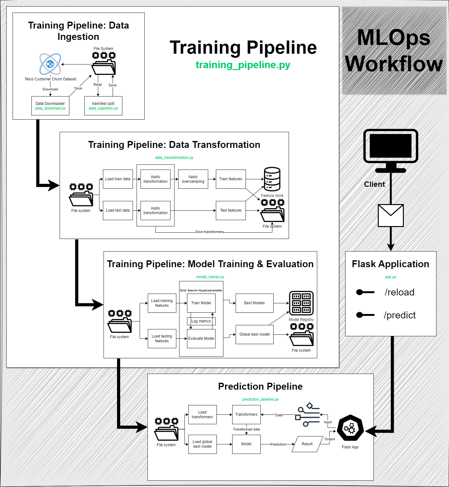

# Problem Statement:

Telco customer churn rate needs to be reduced to improve business by offering better service. This project aims to find out people who are more likey to churn so that optimal service can be offered to them on a priority basis and reduce the churn rate.

## Business Context:

This project aims to develop a model that can predict telco customer churn rate. That way it will be possible to retain more customer by identifying short comings of the services, improving offerings, providing personalized services to each customer based on historical data.

# Dataset Details:
Let's visualize the data structure and features:


## Dataset Processing
The dataset has been randomly split between train and test set, where the ratio between train and test are 80%:20%. The data is first encoded using Label Encoder to encode the categorical data into numeric ones. Followed by a MinMaxScaler transformation to normalize the data. The raw data is versioned controlled using dvc and the processed data is stored in feature store.


# Solution Overview
In this project four classifiers are trained and evaluated using a 10 fold cross validation training method where the hyperparameters are tuned using grid search strategy. The best model based on the highest accuracy is stored and used by the flask application.



## Solution Stages
The ML workflow is divided into the following stages.

### Data Ingestion
In this stage data is downloaded from source. The data is split into train/test sets. Afterwards, they are version controlled using dvc and saved to filesystem.

### Data Transformation
In the transformation stage, the data is transformed into features that can be used to train models. The train/test data are loaded from the filesystem. The data is transformed into numerical value and normalized for categorical and numerical data respectively. The data has imbalanced samples. They are oversampled using SMOT technique. The final processed data is saved in the file system as training features and added to feature store. The transformers are stored in the filesystem alongside the models to transform prediction data.

### Training Pipeline
During training the features are read from the filesystem. The classifiers are trainined on the train features using grid search to optimize the hyperparameters and find the best model. All the trained models are evaluated using the test features. The models along with the best model including all their metrics are stored in the feature store using mlflow.

The four classifiers are:
- XGBClassifier
- RandomForest
- DecisionTree
- LogisticRegression

The hyperparameter ranges tuned are given in the code block below

```python
{
    "XGBClassifier": {
        "model": XGBClassifier(eval_metric = 'logloss'),
        "params": {
            'n_estimators': [100, 500, 1000],
            'max_depth': [3, 5, 7],
            'learning_rate': [0.01, 0.1, 0.2],
            'subsample': [0.8, 1.0],
            'colsample_bytree': [0.8, 1.0]
        }
    },
    "RandomForest": {
        "model": RandomForestClassifier(),
        "params": {
            "class_weight": ["balanced"],
            'n_estimators': [20, 50, 30],
            'max_depth': [10, 8, 5],
            'min_samples_split': [2, 5, 10],
        }
    },
    "DecisionTree": {
        "model": DecisionTreeClassifier(),
        "params": {
            "class_weight": ["balanced"],
            "criterion": ['gini', "entropy", "log_loss"],
            "max_depth": [3, 4, 5, 6],
            "min_samples_split": [2, 3, 4, 5],
        }
    },
    "LogisticRegression": {
        "model": LogisticRegression(),
        "params": {
            "class_weight": ["balanced"],
            'C': [0.001, 0.01, 0.1, 1, 10],
            'solver': ['liblinear', 'saga']
        }
    }
}
```

### Prediction Pipeline
The prediction pipeline recieves data from clients or flask applications. It loads the model and transformers. The prediction data is transformed using the transformers. Afterwards, prediction is performed using the best model and result is returned to caller.

### Flask Applicaiton
The flask application is used to facilitate testing the model. The model is loaded and takes request from this application for prediction. The flask app has two endpoints.
- GET /reload - this endpoint reloads the model and transformers
- POST /predict - this endpoint is used to predict churn possibility based on input

Sample payload for `/predict` endpoint
```json
{
    "customerID": "9305-CDSKC",
    "gender": "Female",
    "SeniorCitizen": 0,
    "Partner": "No",
    "Dependents": "No",
    "tenure": 8,
    "PhoneService": "Yes",
    "MultipleLines": "Yes",
    "InternetService": "Fiber optic",
    "OnlineSecurity": "No",
    "OnlineBackup": "No",
    "DeviceProtection": "Yes",
    "TechSupport": "No",
    "StreamingTV": "Yes",
    "StreamingMovies": "Yes",
    "Contract": "Month-to-month",
    "PaperlessBilling": "Yes",
    "PaymentMethod": "Electronic check",
    "MonthlyCharges": 99.65,
    "TotalCharges": "820.5"
}
```
# Project Structure:

- src directory contains the ML code
  - this directory is divided into several packages
    - data: for data acquisition
    - features: for data processing
    - logger: for logging info and errors
    - models: for training
    - pipelines: to setup train and predict pipelines
    - utils: common utils
    - monitoring: not applicable for this project
    - exceptions: not applicable for this project
- data direcotry contains the data (raw, processed)
- models direcotry contains the best models and preprocessors

## Class Diagram:
The following class diagram shows the relationship between the major classes. The training and flask app are started using the main.py and app.py respectively. These scripts in turn executes the the pipeline classes to run training and prediction.


## Package Diagram:
The package diagram shows the relationship between the packages.


# How to Run:

In order to run the project follow the below steps:

## Install Git

First step is to install git. Download git from online for windows or install from distro repository for linux

## Clone repository

Then clone the repository and move into it

```bash
git clone https://github.com/mtrp12/mlops-workflow-1.git
cd mlops-workflow-1
``` 

## Dependency installation
System should have python install to begin the dependency installation.
```bash
python3 -m venv venv
./venv/Scripts/activate
pip install -e .
```
This should install all the dependencies in a subdirectory

## Start mlflow
MLFlow needs to be started before running the training. MLFlow UI runs on http://localhost:5000
```bash
mlflow ui
```

## Run training
The training pipeline trains all the models and stores the best model using Grid Search strategy.
```bash
python main.py
```

## Run flask application
This will start a flast python application server at localhost:8000 port
host: localhost
port: 8000
```bash
python app.py
```

## Check prediction
This script simulates a request to the flast app on http://localhost:8000/predict. It takes a json payload on a POST request.
```bash
python send_request.py
```

## Reload Flask app models
It is possible to reload the models without shutting down the application. If a new model has been trained, it can be reloaded by the app by sending a get request to the application.

```http
GET http://localhost:8000/reload
```

## Start Feature Store UI
The feature store can be browsed using the following command. After running the command the feature store will be available on http://localhost:8888
```bash
cd feature_repo
feast ui
```